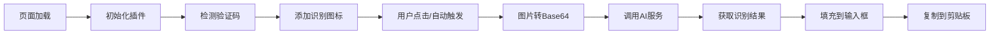

# CAPTCHA-automatic-recognition（AI验证码自动识别填充）

## 📋 项目概述

CAPTCHA-automatic-recognition 是一个基于油猴脚本（UserScript）的智能验证码识别工具，通过集成主流 AI 视觉模型服务，实现网页验证码的自动识别和填充功能。项目使用 Vue 3 + Vite 构建，支持 OpenAI、Google Gemini、阿里云通义千问等多个 AI 服务商。

### 🌟 核心特性

- 🤖 **多AI服务商支持** - OpenAI、Gemini、通义千问
- 🎯 **智能识别** - 支持字符识别和数学计算题
- 🔄 **自动化处理** - 自动检测、识别、填充验证码
- 📦 **云端规则** - 支持远程规则配置，自动适配各网站
- 🎨 **友好界面** - 现代化设置面板，操作简单直观
- 🔧 **高度可定制** - 支持自定义选择器和高级配置

## 🛠️ 技术架构

### 技术栈

| 技术 | 版本 | 说明 |
|------|------|------|
| Vue | 3.4.27 | 前端框架 |
| Vite | 5.2.12 | 构建工具 |
| vite-plugin-monkey | 4.0.0 | 油猴脚本打包插件 |
| Less | 4.1.0 | CSS预处理器 |
| Axios | 1.6.2 | HTTP请求库 |

### 项目结构

```
CAPTCHA-automatic-recognition/
├── src/                        # 源代码目录
│   ├── main.js                # 应用入口文件
│   ├── app.vue                # 核心组件（2765行）
│   └── assets/                # 资源文件
│       ├── app.less           # 样式文件（763行）
│       ├── prompts.js         # AI提示词配置
│       └── logo.png           # 项目图标
├── docs/                      # 文档目录
│   └── advanced-settings.md  # 高级设置使用指南
├── rules.json                 # 验证码识别规则配置
├── vite.config.js            # Vite构建配置
├── package.json              # 项目依赖配置
├── version-log.md            # 版本更新日志
└── index.html                # 开发测试页面
```

## 🚀 功能详解

### 1. 验证码检测系统

#### 多重选择器策略
- **内置选择器**: 11个验证码图片选择器 + 6个输入框选择器
- **自定义选择器**: 用户可添加特定网站的选择器
- **云端规则**: 通过 rules.json 远程配置

#### 智能元素识别
```javascript
// 支持的元素类型
-  标签图片
- <canvas> 画布元素
- 跨域图片自动处理
```

#### 四级输入框查找算法
1. **父元素查找** - 在验证码图片的父元素中查找
2. **表单查找** - 向上查找表单元素
3. **文档查找** - 在整个文档中查找
4. **通用查找** - 使用模糊匹配策略

### 2. AI识别引擎

#### 支持的AI服务商

| 服务商 | 默认模型 | 特点 |
|--------|----------|------|
| OpenAI | gpt-4.1-mini | 识别准确率高 |
| Google Gemini | gemini-2.5-flash-lite | 速度快，稳定性好 |
| 阿里云通义千问 | qwen-vl-max | 中文验证码识别优秀 |

#### 图像处理流程
```
验证码图片 → Base64编码 → AI识别 → 结果处理 → 自动填充
```

#### 智能提示词系统
- 专业的验证码识别提示词
- 支持字符识别和数学计算
- 可自定义提示词优化识别效果

### 3. 自动化功能

- ✅ **自动识别** - 检测到验证码变化时自动触发
- ✅ **自动填充** - 识别成功后自动填充输入框
- ✅ **剪贴板复制** - 自动复制识别结果
- ✅ **实时监控** - MutationObserver监听DOM变化

### 4. 规则管理系统

#### 规则配置格式
```json
{
  "url_pattern": "example.com",           // URL匹配模式
  "captcha_image_selector": "img.captcha", // 验证码选择器
  "captcha_input_selector": "input#code"   // 输入框选择器
}
```

#### URL匹配模式
- **精确匹配**: `"example.com"`
- **通配符**: `"*.example.org"`
- **正则表达式**: `"/^https:\/\/.*\.com$/"`
- **全局匹配**: `"*"` 或留空

### 5. 用户界面

#### 设置面板结构
- **AI服务商设置** - API密钥、模型、端点配置
- **功能设置** - 自动识别、剪贴板、通知开关
- **禁用域名** - 设置不启用识别的网站
- **高级设置** - 自定义选择器、规则管理

#### UI特性
- 响应式设计，适配不同屏幕
- 右侧滑出式面板
- Toast消息提示
- API连通性测试

## 💻 核心实现

### 关键方法说明

| 方法名 | 功能 | 位置 |
|--------|------|------|
| `detectCaptchas()` | 检测页面验证码 | [app.vue:1149](src/app.vue) |
| `addRecognitionIcon()` | 添加识别按钮 | [app.vue:2243](src/app.vue) |
| `imageToBase64()` | 图片转Base64 | [app.vue:811](src/app.vue) |
| `recognizeCaptcha()` | AI识别验证码 | [app.vue:737](src/app.vue) |
| `processCaptcha()` | 处理识别结果 | [app.vue:1410](src/app.vue) |
| `findInputFieldForCaptcha()` | 查找输入框 | [app.vue:2415](src/app.vue) |

### 验证码识别流程



### 跨域处理机制

```javascript
// 自动处理跨域图片
if (!imgSrc.startsWith("data:image") && !this.isSameOrigin(imgSrc)) {
  element.crossOrigin = "anonymous";
  element.src = `${imgSrc}?_t=${timestamp}`;
}
```

## 🔧 配置管理

### 存储方案

| 环境 | 存储方式 | API |
|------|----------|-----|
| 油猴环境 | 脚本存储 | `GM_getValue`/`GM_setValue` |
| 开发环境 | 本地存储 | `localStorage` |

### 配置项说明

```javascript
settings: {
  // AI服务配置
  apiType: "openai",              // API类型
  openaiKey: "",                  // OpenAI密钥
  openaiApiUrl: "",               // 自定义API地址
  openaiModel: "",                // 模型名称
  openaiPrompt: "",               // 自定义提示词
  
  // 功能开关
  autoRecognize: false,           // 自动识别
  copyToClipboard: true,          // 自动复制
  showNotification: true,         // 显示通知
  autoFetchCloudRules: false,     // 自动获取云端规则
  
  // 高级设置
  customCaptchaSelectors: [],     // 自定义验证码选择器
  customInputSelectors: [],       // 自定义输入框选择器
  disabledDomains: "",           // 禁用域名列表
  rulesUrl: ""                   // 规则文件URL
}
```

## 🚦 安装使用

### 前置要求

1. 安装油猴扩展（Tampermonkey 或 Violentmonkey）
2. 获取AI服务API密钥（至少一个）

### 安装步骤

1. **安装脚本**
   - 从 Greasyfork 安装（推荐）
   - 或从 GitHub 安装开发版

2. **配置API**
   - 进入任意有验证码的网页
   - 点击验证码旁的识别图标
   - 在设置面板中配置API密钥

3. **开始使用**
   - 手动点击识别图标
   - 或开启自动识别功能

## 🔨 开发指南

### 环境准备

```bash
# 克隆项目
git clone https://github.com/anghunk/UserScript.git

# 进入项目目录
cd CAPTCHA-automatic-recognition

# 安装依赖
yarn install
# 或
npm install
```

### 开发命令

```bash
# 启动开发服务器
yarn dev

# 构建生产版本
yarn build

# 预览构建结果
yarn preview
```

### 构建配置

```javascript
// vite.config.js 关键配置
{
  plugins: [
    vue(),
    monkey({
      entry: 'src/main.js',
      userscript: {
        match: ['*://*/*'],
        grant: [
          'GM_xmlhttpRequest',
          'GM_setValue',
          'GM_getValue',
          'GM_registerMenuCommand'
        ]
      },
      build: {
        externalGlobals: {
          vue: cdn.unpkg('Vue', 'dist/vue.global.prod.js')
        },
        minify: false  // 不混淆代码
      }
    })
  ]
}
```

## 🎯 性能优化

### 优化策略

1. **防抖处理** - 500ms延迟避免频繁触发
2. **选择器缓存** - 减少DOM查询
3. **图像预检测** - 提前检查图片可识别性
4. **异步处理** - 不阻塞主线程

### 兼容性处理

- 特殊网站适配（nportal.ntut.edu.tw、www.luogu.com.cn）
- 样式隔离（使用 `!important` 确保优先级）
- 降级处理策略

## 📊 版本历史

### v1.2.0 (最新版)
- ✨ 新增每日自动获取云端规则功能
- 🎨 重构配置面板，提升兼容性

### v1.1.x 系列
- 🔧 Canvas验证码支持
- 🌐 云端规则系统
- 🤖 多AI服务商支持

### v1.0.x 系列
- 🚀 基础功能实现
- 📱 UI界面优化
- 🐛 兼容性修复

[查看完整更新日志](version-log.md)

## 🤝 贡献指南

### 如何贡献

1. Fork 项目
2. 创建功能分支 (`git checkout -b feature/AmazingFeature`)
3. 提交更改 (`git commit -m 'Add some AmazingFeature'`)
4. 推送到分支 (`git push origin feature/AmazingFeature`)
5. 提交 Pull Request

### 问题反馈

- 在 [GitHub Issues](https://github.com/anghunk/UserScript/issues) 提交问题
- 提供网站域名和错误信息
- 附上控制台截图（如有）

## 📄 许可证

本项目基于 Apache-2.0 许可证开源，详见 [LICENSE](LICENSE) 文件。

## ⚠️ 免责声明

1. 本项目仅供学习研究使用
2. 请遵守相关网站的服务条款
3. 不得用于非法用途
4. 作者不承担任何使用风险

## 🔗 相关链接

- [GitHub 仓库](https://github.com/anghunk/UserScript/tree/main/CAPTCHA-automatic-recognition)
- [Greasyfork 脚本页](https://greasyfork.org/scripts/540822)
- [高级设置教程](docs/advanced-settings.md)
- [问题反馈](https://github.com/anghunk/UserScript/issues)

## 👨‍💻 作者

**anghunk**
- GitHub: [@anghunk](https://github.com/anghunk)

---

<div align="center">
  <sub>如果这个项目对你有帮助，请给个 ⭐ Star 支持一下！</sub>
</div>